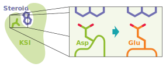
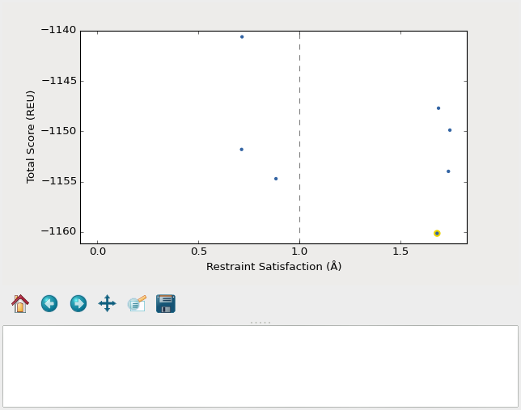
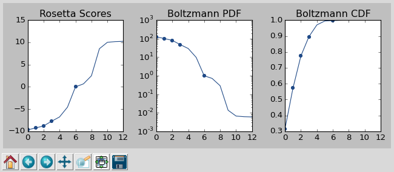

*******************************
Rescue the D38E mutation in KSI
*******************************
Ketosteroid isomerase (KSI) is a model enzyme that catalyzes the rearrangement 
of a double bond in steroid molecules.  Asp38 is the key catalytic residue 
responsible for taking a proton from one site and moving it to another:

The enzyme is 200x less active when Asp38 is mutated to Glu (D38E), even though 
Asp and Glu have the same carboxyl (COOH) functional group.  The difference is 
that Glu has one more carbon in its sidechain, so the COOH is shifted out of 
position by just over 1Å.  This demo will show everything you would need to do 
to use Pull Into Place (PIP) to redesign the active site loop to correct the 
position of the COOH in the D38E mutant.

.. note::

   This demo assumes that you're running the Rosetta simulations on the QB3 
   cluster at UCSF.  If you're using a different cluster, you may have to adapt 
   some of the commands (most notably the ``ssh`` ones, but maybe others as 
   well).  That said, I believe the ``pull_into_place`` commands themselves 
   should be the same.
   
Before you start
================
Before starting the demo, you will need to install PIP on both your workstation 
and your cluster.  See the :doc:`installation page <../../install>` for 
instructions.  If you installed PIP correctly, this command should produce a 
lengthy help message::

   $ pull_into_place --help

You also need to have Rosetta compiled on both your workstation and your 
cluster.  See the :ref:`Rosetta section of the installation page 
<installing-rosetta>` for instructions.  In general, PIP doesn't care where 
rosetta is installed; it just needs a path to the installation.  This tutorial 
will assume that rosetta is installed in ``~/rosetta`` such that::

   $ ls ~/rosetta/source/bin
   ...
   rosetta_scripts
   ...

Finally, you need to download the `example input files`__ we'll be using onto 
your cluster.  If your cluster has ``svn`` installed, you can use this command 
to download all these files at once::

   # Run this command on ``iqint`` if you're using the QB3 cluster.
   $ svn export https://github.com/Kortemme-Lab/pull_into_place/trunk/demos/ksi ~/ksi_inputs

Otherwise, you can download them by hand onto your workstation and use ``scp`` 
to copy them onto your cluster.  You can put the input files wherever you want, 
but the tutorial will assume that they're in ``~/ksi_inputs`` such that::

   $ ls ~/ksi_inputs
   EQU.cen.params
   EQU.fa.params
   KSI_D38E.pdb
   KSI_WT.pdb
   flags
   loops
   resfile
   restraints

__ https://github.com/Kortemme-Lab/pull_into_place/tree/master/demos/ksi

Set up your workspaces
======================
Our first step is to create a workspace for PIP.  A workspace is a directory 
that contains all the inputs and outputs for each simulation.  We will call our 
workspace ``~/rescue_ksi_d38e`` and by the end of this step it will contain all 
the input files that describe what we're trying to design.  It won't (yet) 
contain any simulation results.

We will also use workspaces to sync files between our workstation and the 
cluster.  The workspace on the cluster will be "normal" and will not know about 
the one on our workstation.  In contrast, the workspace on our workstation will 
know about the one on the cluster and will be able to transfer data to and from 
it:

.. note::
   Pay attention to the ``ssh chef.compbio.ucsf.edu`` and ``exit`` commands, 
   because they indicate which commands are meant to be run on your workstation 
   and which are meant to be run on the cluster.
   
   The ``ssh shef.compbio.ucsf.edu`` command means that you should log onto the 
   cluster and run all subsequent commands should on the cluster.  The ``exit`` 
   command means that you should log off the cluster and run all subsequent 
   commands on your workstation.  If you get errors, especially ones that seem 
   to involve version or dependency issues, double check to make sure that 
   you're logged onto the right machine.

::

   $ ssh chef.compbio.ucsf.edu   # log onto the cluster
   $ pull_into_place 01 rescue_ksi_d38e
   Please provide the following pieces of information:

   Rosetta checkout: Path to the main directory of a Rosetta source code checkout.  
   This is the directory called 'main' in a normal rosetta checkout.  Rosetta is 
   used both locally and on the cluster, but the path you specify here probably 
   won't apply to both machines.  You can manually correct the path by changing 
   the symlink called 'rosetta' in the workspace directory.

   Path to rosetta: ~/rosetta

   Input PDB file: A structure containing the functional groups to be positioned.  
   This file should already be parse-able by rosetta, which often means it must be 
   stripped of waters and extraneous ligands.

   Path to the input PDB file: ~/ksi_inputs/KSI_D38E.pdb

   Loops file: A file specifying which backbone regions will be allowed to move.  
   These backbone regions do not have to be contiguous, but each region must span 
   at least 4 residues.

   Path to the loops file: ~/ksi_inputs/loops

   Resfile: A file specifying which positions to design and which positions to 
   repack.  I recommend designing as few residues as possible outside the loops.

   Path to resfile: ~/ksi_inputs/resfile

   Restraints file: A file describing the geometry you're trying to design.  In 
   rosetta parlance, this is more often (inaccurately) called a constraint file.  
   Note that restraints are not used during the validation step.

   Path to restraints file: ~/ksi_inputs/restraints

   Score function: A file that specifies weights for all the terms in the score 
   function, or the name of a standard rosetta score function.  The default is 
   talaris2014.  That should be ok unless you have some particular interaction 
   (e.g. ligand, DNA, etc.) that you want to score in a particular way.

   Path to weights file [optional]: 

   Build script: An XML rosetta script that generates backbones capable of 
   supporting the desired geometry.  The default version of this script uses KIC 
   with fragments in "ensemble-generation mode" (i.e. no initial build step).

   Path to build script [optional]: 

   Design script: An XML rosetta script that performs design (usually on a fixed 
   backbone) to stabilize the desired geometry.  The default version of this 
   script uses fixbb.

   Path to design script [optional]: 

   Validate script: An XML rosetta script that samples the designed loop to 
   determine whether the desired geometry is really the global score minimum.  The 
   default version of this script uses KIC with fragments in "ensemble-generation 
   mode" (i.e. no initial build step).

   Path to validate script [optional]: 

   Flags file: A file containing command line flags that should be passed to every 
   invocation of rosetta for this design.  For example, if your design involves a 
   ligand, put flags related to the ligand parameter files in this file.

   Path to flags file [optional]: ~/ksi_inputs/flags

   Setup successful for design 'rescue_ksi_d38e'.

.. note::

   You don't need to type out the full names of PIP subcommands, you just need 
   to type enough to be unambiguous.  So ``pull_into_place 01`` is the same as 
   ``pull_into_place 01_setup_workspace``.  

You may have noticed that we were not prompted for the ``EQU.cen.params``, 
``EQU.fa.params``, or ``KSI_WT.pdb`` files.  We will use ``KSI_WT.pdb`` to 
compare against later on, but PIP doesn't need it.  ``EQU.cen.params`` and 
``EQU.fa.params`` are ligand parameters for centroid and fullatom mode, 
respectively.  PIP doesn't specifically ask for ligand parameter files, but we 
still need them for our simulations because we referenced them in ``flags``::

   $ cat ~/rescue_ksi_d38e/flags
   -extra_res_fa EQU.fa.params
   -extra_res_cen EQU.cen.params
   
The paths in ``flags`` are relative to the workspace directory, because PIP 
sets the current working directory to the workspace directory for every 
simulation it runs.  Therefore, in order for these paths to be correct, we have 
to manually copy the ligand parameters files into the workspace::

   $ cp ~/ksi_inputs/EQU.*.params ~/rescue_ksi_d38e
   $ exit   # log off the cluster and return to your workstation

Now that the workspace on the cluster is all set up, we can make a workspace on 
our workstation that links to it::

   $ cd ~
   $ pull_into_place 01 -r rescue_ksi_d38e
   Please provide the following pieces of information:
   
   Rosetta checkout: Path to the main directory of a Rosetta source code checkout.  
   This is the directory called 'main' in a normal rosetta checkout.  Rosetta is 
   used both locally and on the cluster, but the path you specify here probably 
   won't apply to both machines.  You can manually correct the path by changing 
   the symlink called 'rosetta' in the workspace directory.
   
   Path to rosetta: ~/rosetta
   
   Rsync URL: An ssh-style path to the directory that contains (i.e. is one level 
   above) the remote workspace.  This workspace must have the same name as the 
   remote one.  For example, to link to "/path/to/my_design" on chef, name this 
   workspace "my_design" and set its rsync URL to "chef:path/to".
   
   Path to project on remote host: chef.compbio.ucsf.edu:
   
   receiving incremental file list
   ./
   EQU.cen.params
   EQU.fa.params
   build_models.xml
   design_models.xml
   flags
   input.pdb.gz
   loops
   resfile
   restraints
   scorefxn.wts
   validate_designs.xml
   workspace.pkl
   
   sent 322 bytes  received 79,420 bytes  31,896.80 bytes/sec
   total size is 78,647  speedup is 0.99

If this command was successful, all of the input files from the cluster, even 
the ligand parameters, will have been automatically copied from the cluster to 
your workstation.  This workspace is also properly configured for you to use 
``pull_into_place push_data`` and ``pull_into_place fetch_data`` to copy data 
to and from the cluster.

Build initial backbone models
=============================
The first actual design step in the pipeline is to generate a large number of 
backbone models that support the desired sidechain geometry.  This will be done 
by running a flexible backbone simulation while applying the restraints we 
added to the workspace.

You can control which loop modeling algorithm is used for this step by manually 
editing ``build_models.xml``.  The default algorithm is kinematic closure (KIC) 
with fragments, which samples conformations from a fragment library and uses 
KIC to keep the backbone closed.  This algorithm was chosen for its ability to 
model large conformational changes, but it does require us to make a fragment 
library before we can run the model-building simulation::

   $ ssh chef.compbio.ucsf.edu
   $ pull_into_place 02_setup_model_fragments rescue_ksi_d38e

.. note::
   Generating fragment libraries is the most fragile part of the pipeline.  It 
   only works on the QB3 cluster at UCSF, and even there it breaks easily.  If 
   you have trouble with this step, you can consider using a loop modeling 
   algorithm that doesn't require fragments.

This step should take about an hour.  Once it finishes, we can generate our 
models::

   $ pull_into_place 03 rescue_ksi_d38e --test-run
   $ exit

With the ``--test-run`` flag, which dramatically reduces both the number and 
length of the simulations, this step should take about 30 minutes.  This flag 
should not be used for production runs, but I will continue to use it 
throughout this demo with the idea that your goal is just to run through the 
whole pipeline as quickly as possible.

Once the simulations finish, we can download the results to our workstation and 
visualize them::

   $ pull_into_place fetch_data rescue_ksi_d38e
   $ pull_into_place plot_funnels rescue_ksi_d38e/01_restrained_models/outputs

   A screenshot of the ``plot_funnels`` GUI.

Remember that the purpose of this step is to generate physically realistic 
models with the geometry we want to design.  These two goals are somewhat at 
odds with each other, in the sense that models that are less physically 
realistic should be able to achieve more ideal geometries.  The second command 
displays a score vs. restraint satisfaction plot that we can use to judge how 
wells these two goals were balanced.  If too many models superimpose with the 
restraints too well, the restraints might too strong.  If too few models get 
within 1Å of the restraints, they might be to weak.  You can tune the weights 
of the restraints by manually editing ``shared_defs.xml``.

Stabilize good backbone models
==============================
The next step in the pipeline is to select a limited number of backbone models 
to carry forward and to generate a number of designed sequences for each of 
those models.  It's worth noting that the first step in the pipeline already 
did some design, so the purpose of this step is more to quickly generate a 
diversity of designs than to introduce mutations for the first time.

The following command specifies that we want to carry forward any model that 
puts its Glu within 1.0Å of where we restrained it to be::

   $ pull_into_place 04 rescue_ksi_d38e 1 'restraint_dist < 1.0'
   Selected 4 of 8 models

.. note::
   This command just makes symlinks from the output directory of the model 
   building command to the input directory of the design command.  The models 
   that aren't selected aren't deleted, and you run this command more than once 
   if you change your mind about which models you want to keep.

This is a very relaxed threshold because we used ``--test-run`` in the previous 
step and don't have very many models to pick from.  For a production run, I 
would try to set the cutoff close to 0.6Å while still keeping a couple thousand 
models.  You can also eliminate models based on total score and a number of 
other metrics; use the ``--help`` flag for more information.

Also note that we had to specify the round "1" after the name of the workspace.  
In fact, most of the commands from here on out will expect a round number.  
This is necessary because, later on, we will be able to start new rounds of 
design by picking models from the results of validation simulations.  We're 
currently in round 1 because we're still making our first pass through the 
pipeline.

Once we've chosen which models to design, we need to push that information to 
the cluster::

   $ pull_into_place push rescue_ksi_d38e

Then we can log into the cluster and start the design simulations::

   $ ssh chef.compbio.ucsf.edu
   $ pull_into_place 05 rescue_ksi_d38e 1 --test-run
   $ exit

With the ``--test-run`` flag, this step should take about 30 min.  When the 
design simulations are complete, we can download the results to our workstation 
as before::

   $ pull_into_place fetch_data rescue_ksi_d38e

Validate good designs
=====================
You could have hundreds of thousands of designs after the design step, but it's 
only really practical to validate about a hundred of those.  Due to this vast 
difference in scale, picking which designs to validate is not a trivial task.

PIP approaches this problem by picking designs with a probability proportional 
to their Boltzmann-weighted scores.  This is naive in the sense that it only 
considers score (although we are interested in considering more metrics), but 
more intelligent than simply picking the lowest scores, which tend to be very 
structurally homogeneous::

   $ pull_into_place 06_pick rescue_ksi_d38e 1 -n5
   Total number of designs:       39
       minus duplicate sequences: 13
       minus current inputs:      13
   
   Press [enter] to view the designs that were picked and the distributions that
   were used to pick them.  Pay particular attention to the CDF.  If it is too
   flat, the temperature (T=2.0) is too high and designs are essentially being
   picked randomly.  If it is too sharp, the temperature is too low and only the 
   highest scoring designs are being picked.

   Accept these picks? [Y/n] y
   Picked 5 designs.

This command will open a window to show you how the scores are distributed and 
which were picked.  As the command suggests, it worth looking at the cumulative 
distribution function (CDF) of the Boltzmann-weighted scores to make sure it's 
neither too flat nor too sharp.

   A screenshot of the ``06_pick_designs_to_validate`` GUI.

The ``-n5`` argument instructs PIP to pick 5 designs to validate.  The default 
is 50, which would be appropriate for a production run.  However, in this demo 
we only have about 50 designs because we've been using the ``--test-run`` flag.  
The algorithm that picks from a Boltzmann weighted distribution gets very slow 
when the number of designs to pick is close to the number of designs to pick 
from, which is why we only pick 5.

It's also worth noting that there is a ``06_manually_pick_designs_to_validate`` 
command that you can use if you have a PDB file with a specific mutation 
(perhaps that you made in pymol) that you want to validate.  This is not 
normally part of the PIP pipeline, though::

   $ pull_into_place 06_man rescue_ksi_d38e 1 path/to/manual/design.pdb

We can push our picks to the cluster in the same way as before::

   $ pull_into_place push rescue_ksi_d38e

The validation step consists of 500 independent loop modeling simulations for 
each design, without restraints.  As with the model building step, the default 
algorithm is KIC with fragments and we need to create fragment libraries before 
we can start the simulations::

   $ ssh chef.compbio.ucsf.edu
   $ pull_into_place 07 rescue_ksi_d38e 1

Once the fragment libraries have been created (as before, this should take 
about an hour), we can run the validation simulations::

   $ pull_into_place 08 rescue_ksi_d38e 1 --test-run
   $ exit

We could wait for the simulations to finish (which as before will take about 30 
min) then download the results to our workstation using the same ``fetch_data`` 
command as before.  However, I generally prefer to use the following command to 
automatically download and cache the results from the validation simulations as 
they're running::

   $ pull_into_place fetch_and_cache rescue_ksi_d38e/03_validated_designs_round_1/outputs --keep-going

The simulations in production runs generate so much data that it can take 
several hours just to download and parse it all.  This command gets rid of that 
wait by checking to see if any new data has been generated, and if it has, 
downloading it, parsing it, and caching the information that the rest of the 
pipeline will need to use.  The ``--keep-going`` flag tells the command to keep 
checking for new data over and over again until you hit ``Ctrl-C``, otherwise 
it would check once and stop.

Once we've downloaded all the data, we can use the ``plot`` command again to 
visualize the validation results::

   $ pull_into_place plot rescue_ksi_d38e/03_validated_designs_round_1/outputs/*

Iterate the design process
==========================
Often, some of the models from the validation simulations will fulfill the 
design goal really well despite not scoring very well.  These models are 
promising because they're clearly capable of supporting the desired geometry, 
and they may just need another round of design to make the conformation in 
question the most favorable.

You can use the ``04_pick_models_to_design`` command to pick models from the 
validation simulations to redesign.  The command has exactly the same form as 
when we used it after the model building step, we just need to specify that 
we're in round 2 instead of round 1::

   $ pull_into_place 04 rescue_ksi_d38e 2 'restraint_dist < 1'

I won't repeat the remaining commands in the pipeline, but they're exactly the 
same as before, with the round number updated as appropriate.

For a production run, I would recommend doing at least two rounds of design.  I 
believe that models from the validation simulations -- which are the basis for 
the later rounds of design -- are more relaxed than the initial models, which 
makes them better starting points for design.  At the same time, I would 
recommend against doing more than three or four rounds of design, because 
iterated cycles of backbone optimization and design seems to provoke artifacts 
in Rosetta's score function.

Pick designs to test experimentally
===================================
The final step in the PIP pipeline is to interpret the results from the 
validation simulations and to choose an experimentally tractable number of 
designs to test.  The primary results from the validation simulations are the 
score vs. restraint satisfaction plots.  Promising designs will have distinct 
"funnels" in these plots: the models with the best geometries (i.e. restraint 
satisfaction) will also be the most stable (i.e. Rosetta score).

However, there are other factors we might want to consider as well.  For 
example, you might be suspicious of designs with large numbers of glycine, 
proline, or aromatic mutations.  You might also want to know which designs are 
the most similar to each other -- either in terms of sequence or structure -- 
so you can avoid wasting time testing two designs that are nearly identical.  
Finally, you might be interested in some of general-purpose metrics of protein 
stability that are not well represented by score alone, like the number of 
buried unsatisfied H-bonds or the amount of strain in the designed sidechains.

The following command generates a spreadsheet that conveniently collects all 
this information in one place::

   $ pull_into_place 09 rescue_ksi_d38e 1

This command will create a file called ``quality_metrics.xlsx`` that you can 
open with Excel or any related program.  By default, the spreadsheet will only 
include entries for designs where the lowest scoring model is within 1.2Å of 
satisfying the restraints.  Each column presents a different quality metric, 
and each cell is colored according to how favorable that value of that metric 
is.  The precise meaning and interpretation of each metric is discussed below:

Resfile Sequence
   Show the amino acid identity of every position that was allowed to mutate in 
   the design (although not all of the positions are necessarily different from 
   wildtype).  Use this information to look for specific sequence motifs that 
   make you suspicious.

Sequence Cluster
   Show which designs have the most similar sequences.  Only positions that 
   were allowed to design are considered in this clustering, and no alignment 
   is done.  The sequences are simply compared using a score matrix like 
   BLOSUM80.  Use this metric to avoid picking too many designs that are too 
   similar to each other.

Struct Cluster
   Show which designs are the most structurally similar.  This metric works by 
   creating a hierarchical clustering of the lowest scoring models for each 
   design based on loop backbone RMSD.  Clusters are then made such that every 
   member in every cluster is within a certain loop RMSD of all its peers.  Use 
   this metric to avoid picking too many designs that are too similar to each 
   other.

Restraint Dist (Å)
   Show how well each design satisfies the design goal, as embodied by the 
   restraints given at the very beginning of the pipeline.

Score Gap (REU)
   Show the difference in score between the lowest scoring models with 
   restraint distances less than and greater than 1Å and 2Å, respectively.  Use 
   this metric to get a rough idea of how deep the score vs. RMSD funnel is for 
   each design.

% Subangstrom
   Show what percent of the models from the validation simulations had 
   sub-angstrom restraint distances.  Use this metric to get a rough idea of 
   how well-populated the score vs. RMSD funnel is.
   
# Buried Unsats
   Show how many buried unsatisfied H-bonds each design has, relative to the 
   input structure given at the very beginning of the pipeline.  This is 
   something that's not accounted for by the Rosetta score function, but that 
   can do a very good job discriminating reasonable backbones from horrible 
   ones.

Dunbrack (REU)
   Show the Dunbrack score for each residue that was part of the design goal 
   (i.e. was restrained in the building step).  High Dunbrack scores indicate 
   unlikely sidechain conformations.

