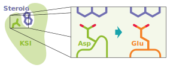
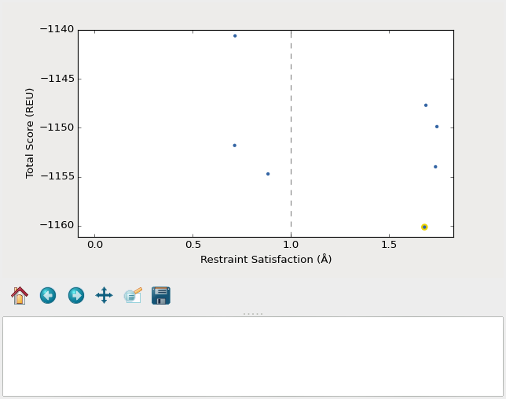
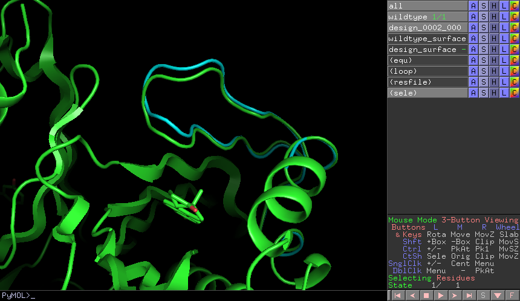
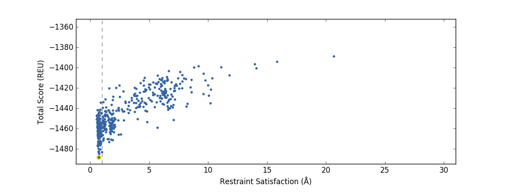
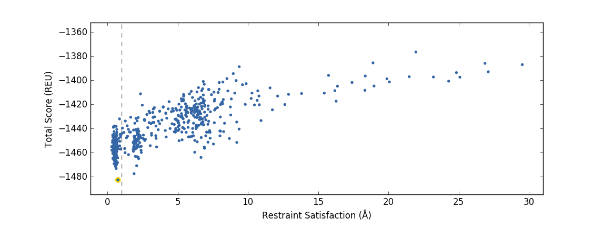

*******************************************
Pull into Place (PIP) Step-by-Step Tutorial
*******************************************

The most up-to-date version of this tutorial `is available on GitHub <https://github.com/Kortemme-Lab/pull_into_place/tree/master/demos/ksi/algosb_exercise>`_.

Model system
============

For the purposes of this tutorial, we will be examining
Ketosteroid isomerase (KSI), which is a model enzyme that catalyzes the rearrangement
of a double bond in steroid molecules.  Asp38 is the key catalytic residue
responsible for taking a proton from one site and moving it to another:

The enzyme is 200x less active when Asp38 is mutated to Glu (D38E), even though
Asp and Glu have the same carboxyl (COOH) functional group.  The difference is
that Glu has one more carbon in its side chain, so the COOH is shifted out of
position by just over 1Å.  This demo will show everything you would need to do
to use Pull Into Place (PIP) to redesign the active site loop to correct the
position of the COOH in the D38E mutant.

Before you start
================

This demo will demonstrate how to run each of the individual PIP stages.
Output will be generated via extremely short trajectories to allow the commands to be run locally on a laptop.
For a real problem, PIP will most likely need to be run on a large cluster (as described in the general PIP documentation).

You also need to have Rosetta compiled on your workstation.
In general, PIP doesn't care where
Rosetta is installed; it just needs a path to the installation.  This tutorial
will assume that Rosetta is installed in ``~/rosetta`` such that::

   $ ls ~/rosetta/source/bin
   ...
   rosetta_scripts
   ...

If your Rosetta installation location varies, you will need to change the ``ROSETTA=`` variable at the top of each run script to the correct location (the path should already be correct if you are using the tutorial virtual machine).

Finally, you need to `download and extract the loop hash database <https://guybrush.ucsf.edu/loophash_db.tar.gz>`_ we'll be using (this is already done in the tutorial virtual machine).
Save it (or symlink it) directly into this folder with the folder name ``loophash_db``.

Input information
=================

All of the required input files have already been generated for you, but here are descriptions of the relevant file types for your future reference:

::

   Input PDB file: A structure containing the functional groups to be positioned.
   This file should already be parse-able by Rosetta, which often means it must be
   stripped of waters and extraneous ligands.

   Loops file: A file specifying which backbone regions will be allowed to move.
   These backbone regions do not have to be contiguous, but each region must span
   at least 4 residues.

   Resfile: A file specifying which positions to design and which positions to
   repack. It is recommended to design as few residues as possible outside the loops.

   Path to resfile: ~/ksi_inputs/resfile

   Restraints file: A file describing the geometry you're trying to design.  In
   Rosetta parlance, this is more often (inaccurately) called a constraint file.
   Note that restraints are not used during the validation step.

   Score function: A file that specifies weights for all the terms in the score
   function, or the name of a standard Rosetta score function.  The default is
   talaris2014.  That should be OK unless you have some particular interaction
   (e.g. ligand, DNA, etc.) that you want to score in a particular way.

   Build script: An XML Rosetta script that generates backbones capable of
   supporting the desired geometry.  The default version of this script uses KIC
   with fragments in "ensemble-generation mode" (i.e. no initial build step).

   Design script: An XML Rosetta script that performs design (usually on a fixed
   backbone) to stabilize the desired geometry.  The default version of this
   script uses fixbb.

   Validate script: An XML Rosetta script that samples the designed loop to
   determine whether the desired geometry is really the global score minimum.  The
   default version of this script uses KIC with fragments in "ensemble-generation
   mode" (i.e. no initial build step).

   Flags file: A file containing command line flags that should be passed to every
   invocation of Rosetta for this design.  For example, if your design involves a
   ligand, put flags related to the ligand parameter files in this file.

Build initial backbone models
=============================

The first actual design step in the pipeline is to generate a large number of
backbone models that support the desired side chain geometry.  This will be done
by running a flexible backbone simulation while applying the restraints we
added to the workspace.

You can control which loop modeling algorithm is used for this step by manually
editing ``build_models.xml``.  The current algorithm is loophash KIC (kinematic closure)
, which samples conformations from a database of loop conformations hashed based on loop
take off and ending points.

With the ``fast`` flag, which dramatically reduces both the number and
length of the simulations, this step should take a few minutes.  This (or similar) flags
should not be used for production runs, but will continue to use it
throughout this demo with the idea that your goal is just to run through the
whole pipeline as quickly as possible.

Once the simulations finish, we can download the results to our workstation and
visualize them

   A screenshot of the ``plot_funnels`` GUI used in the full PIP pipeline.

Remember that the purpose of this step is to generate physically realistic
models with the geometry we want to design.  These two goals are somewhat at
odds with each other, in the sense that models that are less physically
realistic should be able to achieve more ideal geometries.  We can use the displayed
score vs. restraint satisfaction plot to judge how
wells these two goals were balanced.  If too many models superimpose with the
restraints too well, the restraints might be too strong.  If too few models get
within 1Å of the restraints, they might be too weak.  You can tune the weights
of the restraints by manually editing ``restraints``.

 **Task 1:** Run the ``build_models.sh`` script

Stabilize good backbone models
==============================

The next step in the pipeline is to select a limited number of backbone models
to carry forward and to generate a number of designed sequences for each of
those models.  It's worth noting that the first step in the pipeline already
did some design, so the purpose of this step is more to quickly generate a
diversity of designs than to introduce mutations for the first time.

 **Task 2:** Run the ``design_models.sh`` script

Validate good designs
=====================

You could have hundreds of thousands of designs after the design step, but it's
only really practical to validate about a hundred of those.  Due to this vast
difference in scale, picking which designs to validate is not a trivial task.

PIP approaches this problem by picking designs with a probability proportional
to their Boltzmann-weighted scores.  This is naive in the sense that it only
considers score (although we are interested in considering more metrics), but
more intelligent than simply picking the lowest scores, which tend to be very
structurally homogeneous.

In a production run, PIP will open a window to show you how the scores are distributed and
which were picked.  As the command suggests, it worth looking at the cumulative
distribution function (CDF) of the Boltzmann-weighted scores to make sure it's
neither too flat nor too sharp.  This is a subjective judgment, but one good
rule of thumb is that the designs being picked (represented by the circles)
should be mostly, but not exclusively, low-scoring. The example CDF below looks about
like what you'd want:

.. figure:: 06_pick_designs_to_validate.png
   :align: center
   :width: 80 %

   A screenshot of the ``06_pick_designs_to_validate`` GUI.

A production validation step consists of 500 independent loop modeling simulations for
each design, without restraints. We now will use the standard loop modeling algorithm KIC
(instead of loophash KIC as in the initial build step).

 **Task 3:** Run the ``validate_designs.sh`` script

Visualize designs
=================

   A screenshot of the PyMOL scene created by the ``compare_to_wildtype.sho`` script in the full pipeline.

We provide a plugin script that visually compares wild type with mutant structures.
The plugin's philosophy is
to focus on each mutation one-at-a-time to try to understand what interactions
the wild type residue was making and how those interactions are (or are not)
being accommodated by the mutant residue. `Visit this page <https://github.com/kalekundert/wt_vs_mut>`_ for instructions on how to install and use ``wt_vs_mut``.

 **Task 4:** Use the ``wt_vs_mut`` PyMOL script to compare the output structure from the validation step ``validate_designs_KSI_D38E_0001.pdb`` with the wild type crystal structure ``KSI_WT.pdb``. Follow the `wt_vs_mut <https://github.com/kalekundert/wt_vs_mut>`_ instructions to load the PyMOL visualization plugin (this is already installed in the tutorial virtual machine).

* In your terminal, launch PyMOL and load the two structures: ``pymol 4l7k_wt.pdb validate_designs_KSI_D38E_0001.pdb``
* In PyMOL's terminal:

::

   run /path/to/wt_vs_mut.py (is /home/winter/TK/wt_vs_mut/wt_vs_mut.py in the virtual machine)
   hide all
   show car
   show sticks, chain Y and not h.
   align validate_designs_KSI_D38E_0001 and chain Y, KSI_WT and chain Y
   wt_vs_mut KSI_WT, validate_designs_KSI_D38E_0001

Discussion questions
====================

#. Did you find any mutations in your inspection of your validated design (from step ``Validate designs``) that might actually make sense? (Note: we wouldn't expect this to occur after such short simulations, but it is possible).
#. Did you find any mutations that definitely do not look good?

Compare design structures
=========================

We will now compare the validated designs PDB you generated in a short simulation (``validate_designs_KSI_D38E_0001.pdb``) with designs generated from a full run of the PIP protocol.

   An example of a validation PIP run that produces a good design funnel, where the singular energy minima (as measured in Rosetta Energy Units) coincides with highest restraint satisfaction.

   An example of a validation PIP run that produces a bad design funnel with multiple energy minima.

**Task 5:** Examine the structures ``sample_output/output_A.pdb.gz``, ``sample_output/output_B.pdb.gz``, and your ``validate_designs_KSI_D38E_0001.pdb`` output, using whatever structure visualization methods you prefer. Can you determine if output structure "A" or output structure "B" corresponds to the good validation funnel above?

.. Note: A is the good one
